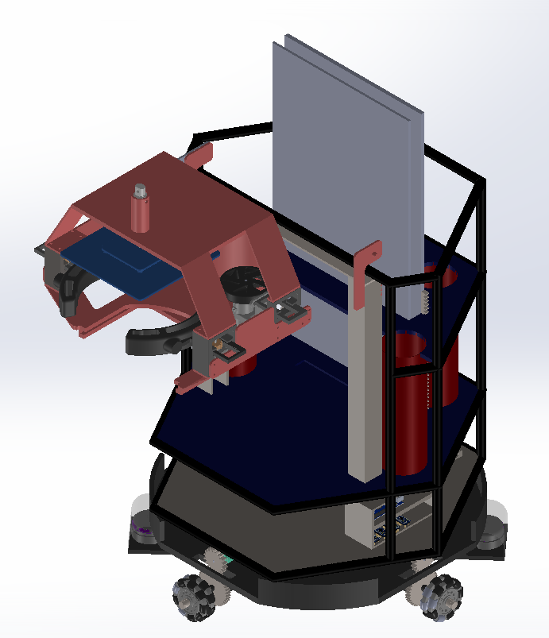

# Robocon Basketballbot Chassis 🤖🏀

## Overview
This repository contains the complete CAD model for a custom "Basketballbot" built for the Robocon competition. Designed to navigate dynamically and manipulate game elements efficiently, the robot features an omnidirectional drive base and a specialized intake/gripper system. 

## Key Mechanisms & Features
* **Drivetrain:** 4-wheel mecanum drive system for holonomic movement, allowing for precise strafing and positioning on the field.
* **Intake/Gripper Assembly:** Custom-designed active manipulator to secure and control the ball, featuring integrated structural supports and a blocking mechanism.
* **Electronics Integration:** Multi-tiered hexagonal chassis design with a dedicated, protected lower deck for the control board and power distribution.
* **Vertical Storage/Magazine:** Integrated structural guides to channel and store game elements.

## Software Used
* **SolidWorks 2021** 

## Repository Structure
The repository is organized to separate top-level assemblies from individual parts:

* 📂 **`CAD_FILES/`**
  * 📂 **`Final_chassis/`**: Contains the main top-level SolidWorks assemblies (e.g., `CHASSIS_MAIN_NEW.SLDASM`) and primary sub-assemblies.
  * 📂 **`Components/`**: Contains all the individual `.SLDPRT` part files (brackets, custom links, mounts, etc.) required by the assemblies.

## How to View
1. Clone this repository: `git clone https://github.com/yourusername/Robocon-Basketballbot.git`
2. Navigate to `CAD_FILES/Final_chassis/` and open the main assembly file in SolidWorks. 
*(Note: If SolidWorks prompts you for missing files, point it to the `CAD_FILES/Components/` folder to resolve the references).*

---
*Designed and modeled as part of the Robocon team at IIT Ropar.*